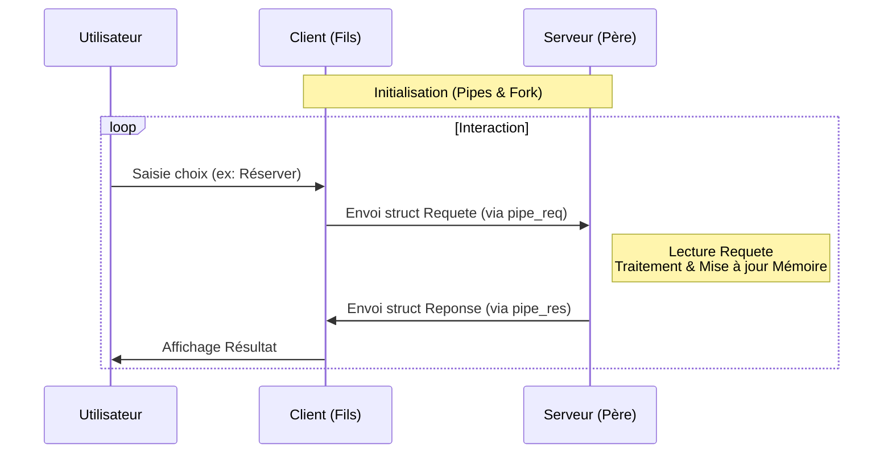

# Rapport de Synthèse - Question 1 : Architecture Client-Serveur par Tubes

Ce rapport détaille la conception et l'implémentation de la première version de l'application de gestion de réservations de spectacles, conformément au cahier des charges de la Question 1.

## 1. Analyse et Conception de l'Application

### Architecture des Processus
L'application est conçue autour d'un modèle **monolithique multi-processus** sur une seule machine :
- **Un Processus Serveur (Père)** : Initialise la mémoire et traite les requêtes.
- **Un Processus Client (Fils)** : Créé par un `fork()` du processus père, il interagit avec l'utilisateur.

### Communication par Tubes (Pipes)
Comme demandé, la communication repose sur des tubes anonymes. Les tubes étant unidirectionnels, nous en utilisons **deux** pour permettre un dialogue bidirectionnel :
1.  **Tube Requête (`pipe_req`)** : Sens Client $\rightarrow$ Serveur.
2.  **Tube Réponse (`pipe_res`)** : Sens Serveur $\rightarrow$ Client.

### Gestion des Données en Mémoire
Le serveur maintient l'état des spectacles dans un tableau en mémoire vive (`table_spectacles`).
- **Choix** : L'utilisation d'un tableau statique (`Spectacle table_spectacles[MAX_SPECTACLES]`) est simple et efficace pour ce prototype.
- **Persistance** : Les données existent tant que le processus serveur est en vie.

### Structure des Échanges
Pour structurer les données transitant dans les tubes (qui sont des flux d'octets bruts), nous avons défini deux structures C rigoureuses. Cela garantit que le client et le serveur interprètent les octets de la même manière.

1.  **`Requete`** (Client vers Serveur) : Contient l'intention (`type`), l'ID du spectacle cible et le nombre de places si nécessaire.
2.  **`Reponse`** (Serveur vers Client) : Contient le statut de l'opération, un message textuel pour l'affichage, et les données demandées (ex: liste des spectacles).

---

## 2. Schéma du Processus Complété

Voici le flux d'exécution simplifié illustrant la boucle d'interaction.



---

## 3. Analyse du Code Implémenté (`client.c`)

Le code fourni (`client.c`) répond point par point aux exigences. Voici l'analyse des sections clés.

### A. Mise en place de l'infrastructure (Main)
Le `main` prépare le terrain avant de lancer les boucles infinies. Il crée les deux tubes puis sépare le processus en deux.

```c
// Extrait de client.c (lignes 152-180)
int main() {
    int pipe_req[2], pipe_res[2];
    pipe(pipe_req); // Création tube requêtes
    pipe(pipe_res); // Création tube réponses

    if (fork() == 0) {
        // Côté Fils (Client) : Ferme les extrémités inutiles
        close(pipe_req[0]); 
        close(pipe_res[1]); 
        run_client(pipe_res[0], pipe_req[1]); // Lance la logique client
    } else {
        // Côté Père (Serveur)
        close(pipe_req[1]);
        close(pipe_res[0]);
        run_server(pipe_req[0], pipe_res[1]); // Lance la logique serveur
        wait(NULL);
    }
    return 0;
}
```

### B. Gestion des Données (Serveur)
Le serveur initialise les spectacles au démarrage. La structure `Spectacle` est simple et adaptée.

```c
// Extrait de client.c (lignes 19-23)
typedef struct {
    int id;
    char titre[MAX_NAME_LEN];
    int places_restantes;
} Spectacle;

// Init (lignes 41-47)
void init_spectacles() {
    table_spectacles[0] = (Spectacle){0, "Le Roi Lion", 100};
    // ...
}
```

### C. Traitement des Requêtes
Le serveur lit les structures `Requete` en boucle. L'utilisation de `read` bloquant permet au serveur d'attendre passivement les ordres du client sans consommer de CPU.

```c
// Extrait de client.c (lignes 56-86)
while (read(fd_read, &req, sizeof(Requete)) > 0) {
    if (req.type == REQ_RESERVATION) {
        // Vérification de la disponibilité
        if (s->places_restantes >= req.nb_places) {
            s->places_restantes -= req.nb_places; // Mise à jour mémoire
            sprintf(res.message, "Réservé: %d places...", req.nb_places);
        } else {
            sprintf(res.message, "Echec: seulement %d places...", s->places_restantes);
        }
    }
    // ... autres cas ...
    write(fd_write, &res, sizeof(Reponse)); // Renvoi de la réponse
}
```

---

## 4. Réponses aux Questions

### Structure de l'application et choix
*   **Pourquoi 2 tubes ?** Un tube est un canal unidirectionnel. Pour qu'un dialogue "Question-Réponse" ait lieu, il est impératif d'avoir un canal pour l'aller (Client vers Serveur) et un canal pour le retour (Serveur vers Client).
*   **Structure des données** : Le choix d'envoyer des structures C (`struct`) complètes binaire (`write(fd, &req, sizeof(req))`) plutôt que du texte formaté simplifie grandement le parsing. Le serveur reçoit directement des entiers exploitables pour les ID et les quantités.

### Difficultés liées à l'introduction de plusieurs clients
La question 7 demande de réfléchir au passage à l'échelle (multi-clients). Avec l'architecture actuelle (tubes anonymes), cela soulève deux problèmes majeurs :

1.  **Problème de la Réponse (Routage)** : 
    *   Si plusieurs processus clients (fils) écrivent dans le même `pipe_req`, le serveur recevra toutes les demandes (les écritures de petite taille sont atomiques).
    *   **Cependant**, le serveur n'a qu'un seul `pipe_res` pour répondre. Si le serveur écrit la réponse dans ce tube partagé, **tous** les clients en attente de lecture (`read`) sont en compétition pour lire cette donnée. Le mauvais client risque de lire la réponse destinée à un autre. Il n'y a pas de moyen simple de "viser" un processus spécifique avec un tube anonyme partagé.

2.  **Héritage des descripteurs** :
    *   Les tubes anonymes nécessitent une parenté (père/fils). Cela oblige le serveur à être le père de tous les clients, ou à passer les descripteurs par des mécanismes complexes. Cela limite grandement la flexibilité (impossible de lancer un client depuis un autre terminal sans lien de parenté).

**Conclusion** : Pour supporter plusieurs clients proprement, il faudra évoluer vers des méchanismes nommés (FIFOs/Tubes nommés) ou des files de messages, permettant d'identifier chaque client ou de créer un canal de réponse dédié par client.
