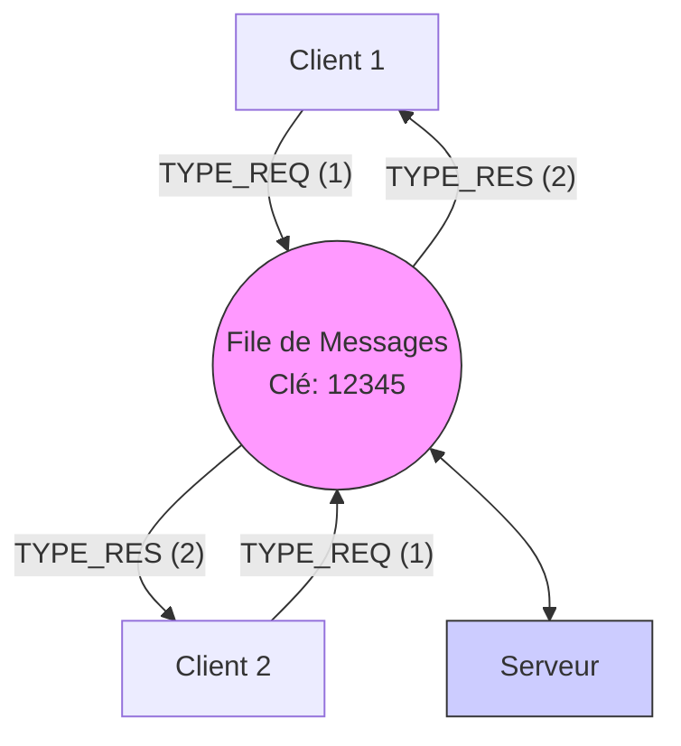
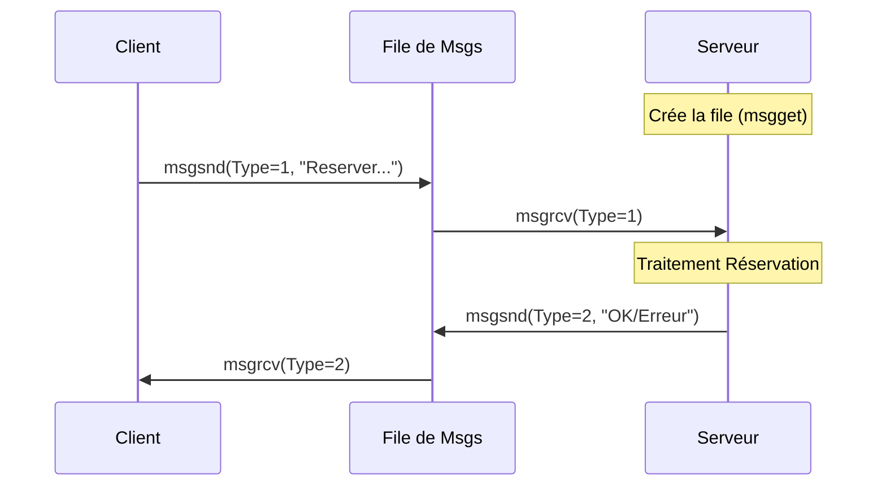

# Rapport de Synthèse - Question 2 : Architecture Client-Serveur par File de Messages

Ce rapport présente la conception et l'implémentation de la seconde version de l'application, utilisant les files de messages IPC System V.

## 1. Analyse et Conception

### Objectifs
- Supporter **plusieurs clients** potentiellement en parallèle.
- Utiliser une **File de Messages (Message Queue)** comme unique canal de communication.
- Maintenir la logique serveur (gestion des stocks en mémoire).

### Architecture : File de Messages Unique

Contrairement aux tubes, une file de messages est une structure noyau persistante et accessible par n'importe quel processus connaissant sa clé (Key). Cela simplifie grandement l'architecture :
1.  **Serveur** : Crée la file avec une clé publique (ex: `12345`). Il lit les messages de type 1 (`TYPE_REQ`) et répond.
2.  **Clients** : Se connectent à cette file existante. Ils écrivent leurs requêtes avec le type 1 et attendent une réponse.

### Problème de l'Adressage (Multiplexing)
Dans l'implémentation actuelle fournie :
- Le Serveur répond avec un message de type `TYPE_RES` (2).
- **Limite** : Tous les clients écoutent le type `TYPE_RES`. Si plusieurs clients attendent une réponse simultanément, le premier qui fait `msgrcv` prendra la réponse, même si elle ne lui est pas destinée (First Come, First Served).
- **Solution (Idéale)** : Dans une implémentation robuste, chaque client devrait inclure son PID dans la requête, et le serveur devrait répondre avec un type égal au PID (`mtype = pid`). Ici, le code utilise un type global (2) pour la simplicité du prototype.

---

## 2. Schémas de Fonctionnement

### Schéma d'Architecture Logique (Mermaid)



### Diagramme de Séquence (Flux Standard)



---

## 3. Analyse du Code Implémenté

### A. Protocole Commun (`protocole.h`)
Les structures définissant les échanges sont partagées. L'utilisation d'une structure dédiée permet de sérialiser les données proprement.

```c
// Extrait de protocole.h
#define CLE_FILE 12345
#define TYPE_REQ 1
#define TYPE_RES 2

typedef struct {
    long type;      // Obligatoire pour msgsnd/msgrcv
    int action;     // 1=Liste, 2=Reserver
    int id_spec;    
    int nb_places;  
} MessageRequete;
```

### B. Le Serveur (`serveur.c`)
Le serveur est un consommateur de messages de type 1 et un producteur de messages de type 2.

```c
// Extrait de serveur.c
int main() {
    int file_id = msgget(CLE_FILE, 0666 | IPC_CREAT);
    
    while (1) {
        // Lecture bloquante des requêtes
        msgrcv(file_id, &req, sizeof(req) - sizeof(long), TYPE_REQ, 0);

        // Traitement métier
        if (req.action == 2 && specs[req.id_spec].stock >= req.nb_places) {
             specs[req.id_spec].stock -= req.nb_places;
             sprintf(res.texte, "Réservation OK");
        }
        
        // Envoi de la réponse (Type 2)
        res.type = TYPE_RES;
        msgsnd(file_id, &res, sizeof(res) - sizeof(long), 0);
    }
}
```

### C. Le Client (`client.c`)
Le client se connecte à la file sans la créer (`0666` sans `IPC_CREAT`).

```c
// Extrait de client.c
int main() {
    int file_id = msgget(CLE_FILE, 0666); // Connexion
    
    // Envoi Requête
    req.type = TYPE_REQ; 
    msgsnd(file_id, &req, ..., 0);

    // Attente Réponse
    msgrcv(file_id, &res, ..., TYPE_RES, 0);
    printf("Réponse : %s\n", res.texte);
}
```

---

## 4. Conclusion et Vérification
L'implémentation respecte les consignes de la Question 2 :
*   [x] **Communication par MSQ** : Utilisation de `msgget`, `msgsnd`, `msgrcv`.
*   [x] **Indépendance** : Les clients et le serveur sont des exécutables distincts (pas de `fork` dans le `main`).
*   [x] **Persistance** : Le serveur gère le cycle de vie de la file (création au début, suppression à la fin).

**Note Importante sur le Parallélisme** : 
Bien que l'architecture permette de lancer plusieurs clients, le mécanisme de réponse actuel (tout le monde écoute le type 2) crée une "course". Avec un trafic faible (TP), cela fonctionne. Pour un système réel, il faudrait utiliser le PID du client comme type de message retour (`res.type = req.pid_client`).
