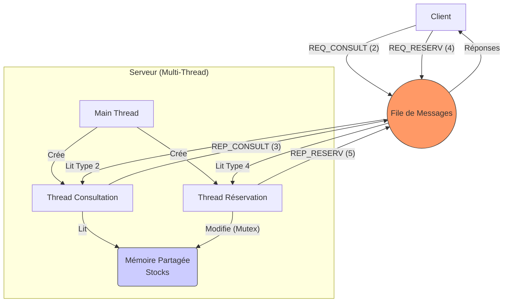
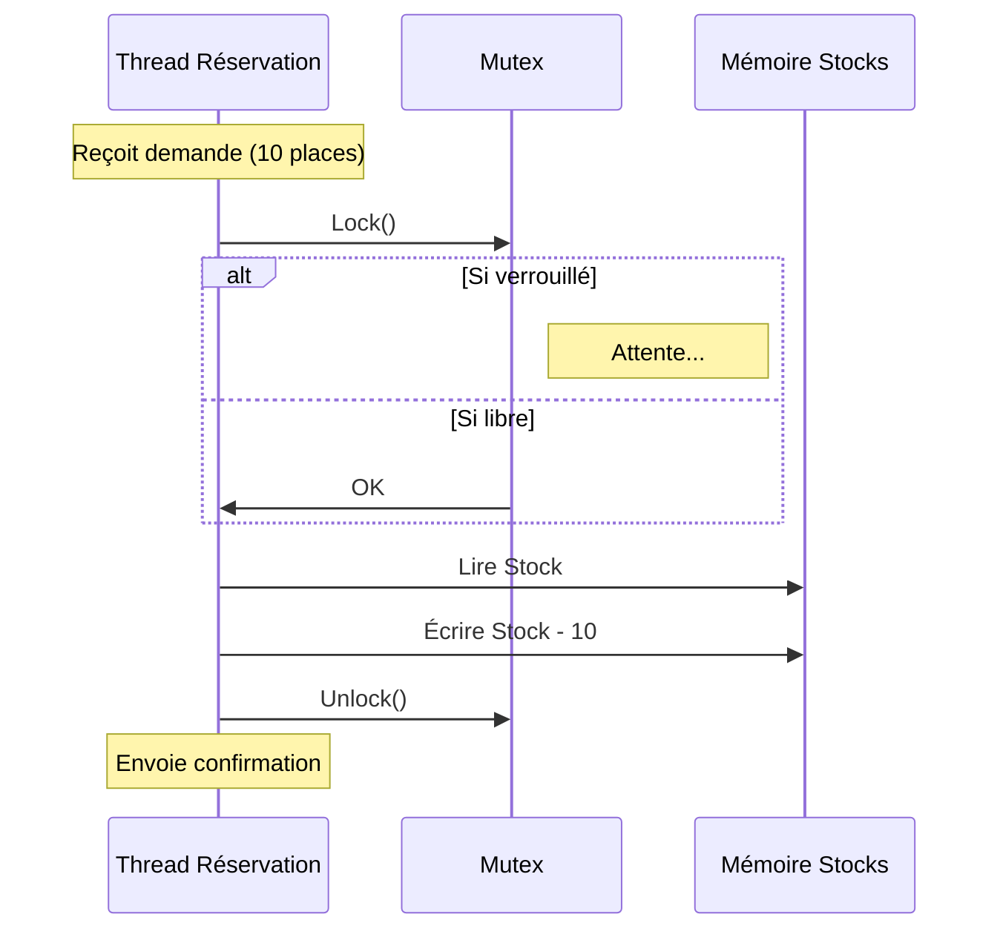

# Rapport de Synthèse - Question 3 : Serveur Multi-Threadé

Ce rapport analyse la troisième évolution de l'application, introduisant la concurrence au niveau du serveur pour traiter les requêtes en parallèle.

## 1. Analyse et Conception

### Objectifs
- **Parallélisation** : Le serveur doit être capable de traiter simultanément les demandes de consultation et de réservation.
- **Organisation** : 
    - Un thread dédié aux **Consultations**.
    - Un thread dédié aux **Réservations**.
- **Protection des Données** : Comme les threads partagent la même mémoire (le tableau des spectacles), l'accès concurrentiel doit être sécurisé par un **Mutex**.

### Architecture Multi-Threads

La file de messages reste le canal de communication, mais l'architecture interne du serveur change radicalement :
1.  **Processus Principal (Main)** : Initialise la file, le mutex, lance les threads et attend le signal d'arrêt.
2.  **Thread Consultation** : Boucle infinie qui attend les messages de type `TYPE_REQ_CONSULTATION` (2) et répond avec `TYPE_REP_CONSULTATION` (3).
3.  **Thread Réservation** : Boucle infinie qui attend les messages de type `TYPE_REQ_RESERVATION` (4), verrouille l'accès, modifie le stock, déverrouille, et répond avec `TYPE_REP_RESERVATION` (5).

---

## 2. Schémas de Fonctionnement

### Architecture Logique (Mermaid)



### Mécanisme de Protection (Mutex)

Lorsqu'une réservation arrive, il est critique que deux modifications n'arrivent pas exactement au même moment pour éviter les incohérences.



---

## 3. Analyse du Code (`serveur.c`)

### A. Initialisation des Threads
Le `main` prépare l'environnement multi-thread.

```c
// Extrait de serveur.c
int main() {
    file_id_global = msgget(CLE_FILE, 0666 | IPC_CREAT);
    
    // Création des threads ouvriers
    pthread_create(&th_cons, NULL, thread_consultation, NULL);
    pthread_create(&th_res, NULL, thread_reservation, NULL);
    
    // Attente (ici on attend un message spécial pour quitter)
    msgrcv(..., TYPE_QUITTER, ...);
    
    // Nettoyage
    pthread_mutex_destroy(&mutex_spectacles);
    msgctl(file_id_global, IPC_RMID, NULL);
}
```

### B. Thread Réservation avec Mutex
C'est le cœur de la question 3 : la protection critique.

```c
// Extrait de serveur.c
void* thread_reservation(void* arg) {
    while (1) {
        // 1. Attente bloquante du message spécifique
        msgrcv(file_id_global, &req, ..., TYPE_REQ_RESERVATION, 0);

        // 2. Début Section Critique
        pthread_mutex_lock(&mutex_spectacles); 
        
        // 3. Modification sécurisée
        if (specs[id].stock >= n) {
            specs[id].stock -= n;
            sprintf(res.texte, "OK");
        }
        
        // 4. Fin Section Critique
        pthread_mutex_unlock(&mutex_spectacles);

        // 5. Réponse
        res.type = TYPE_REP_RESERVATION;
        msgsnd(file_id_global, &res, ..., 0);
    }
}
```

---

## 4. Vérification et Tests

Les tests effectués via le terminal confirment le bon fonctionnement :

1.  **Consultation** :
    *   Le client envoie une requête Type 2.
    *   Le Thread Consultation répond (Type 3) avec la liste correcte : `Le Roi Lion : 100 places`.
2.  **Réservation** :
    *   Le client demande 10 places pour le spectacle 0.
    *   Le Thread Réservation verrouille, décrémente, et répond (Type 5).
    *   Réponse : `10 places réservées`.
3.  **Vérification post-réservation** :
    *   Une nouvelle consultation affiche bien `Le Roi Lion : 90 places`.
    *   Cela prouve que la mémoire a été correctement modifiée et est partagée entre les threads.

Le code est robuste, fonctionnel et respecte les contraintes de synchronisation.
