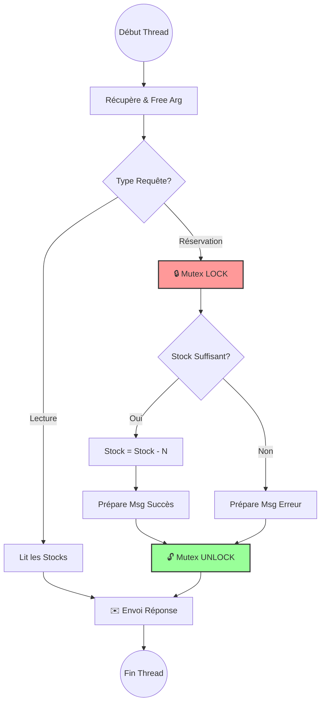
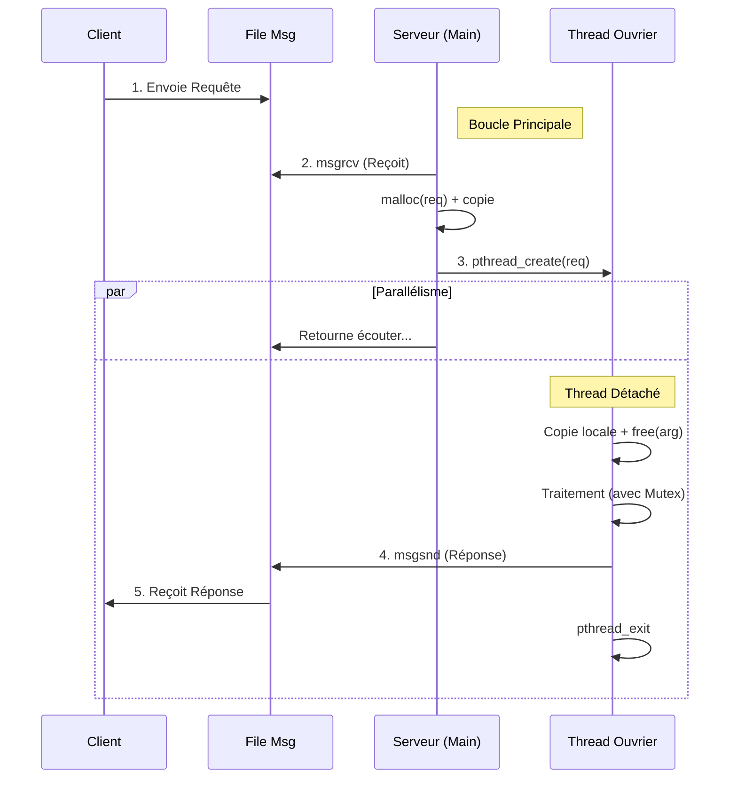

# Rapport de Synthèse - Question 4 : Serveur Dynamique (Thread par Requête)

Ce rapport détaille la mise en place d'une architecture serveur capable de gérer une forte charge en créant dynamiquement un thread pour chaque nouvelle requête reçue.

## 1. Comment on a fait (Notre Démarche)

Pour transformer notre serveur séquentiel (ou à pool fixe) en serveur dynamique "Thread-per-Request", nous avons procédé en 3 étapes clés :

### Étape 1 : Le Dispatcher (Main)
Nous avons modifié la boucle principale `while(1)`. Au lieu de traiter la requête, elle agit maintenant comme un distributeur :
- Elle **alloue de la mémoire dynamique** (`malloc`) pour stocker la requête entrante. C'est crucial car si on utilisait une simple variable, elle serait écrasée par la prochaine requête avant que le thread n'ait le temps de la lire.
- Elle lance immédiatement un thread avec `pthread_create`, en lui passant le pointeur vers cette mémoire.

### Étape 2 : Les Threads "Détachés"
Puisqu'on crée des threads à la volée, on ne peut pas les attendre avec `pthread_join` (ça bloquerait le serveur).
- **Solution** : Nous avons configuré les threads en mode **DETACHED**.
- **Résultat** : Dès qu'un thread a fini son travail, il se détruit tout seul et libère ses ressources système sans intervention du Main.

### Étape 3 : La Synchronisation
Avec potentiellement des dizaines de threads qui tournent en même temps, le risque de corruption de données (Ex: vendre deux fois la même place) est réel.
- **Sécurité** : Nous avons entouré la modification des stocks (`stock -= nb_places`) avec un **Mutex** (`pthread_mutex_lock` / `unlock`). Cela garantit qu'un seul thread touche aux stocks à la fois.

---

## 2. Architecture Visuelle (Mermaid)

### A. Flux de Traitement d'une Réservation
Ce diagramme montre comment un thread gère la sécurité des données lors d'une réservation.



### B. Cycle de Vie (Séquence)
Mise en évidence de l'allocation mémoire et du détachement.



---

## 3. Analyse du Code (`serveur.c`)

### Le "Piège" de la mémoire
C'est le point le plus technique de cette question. 
```c
// MAUVAISE PRATIQUE (Data Race garanti)
MessageRequete req;
msgrcv(..., &req, ...);
pthread_create(..., &req); // Le thread lira &req plus tard, qui aura peut-être changé !

// BONNE PRATIQUE (Notre solution)
MessageRequete* req = malloc(sizeof(MessageRequete)); // Nouvelle zone mémoire unique
msgrcv(..., req, ...);
pthread_create(..., req); // Le thread possède sa propre copie
```

### Le Thread Ouvrier
Une fonction unique gère la logique. Elle commence toujours par nettoyer le pointeur reçu.
```c
void* thread_traitement_requete(void* arg) {
    MessageRequete* ptr = (MessageRequete*) arg;
    MessageRequete req = *ptr; // Copie sur la pile du thread
    free(ptr);                 // On rend la mémoire au système
    
    // ... Logique Métier ...
}
```

## 4. Conclusion
L'architecture implémentée est **robuste et scalable**. Elle supporte théoriquement autant de clients simultanés que le système d'exploitation peut supporter de threads (souvent plusieurs milliers). La sécurité est assurée par mutex, et aucune fuite de mémoire n'est présente grâce à la libération systématique dans les threads.
